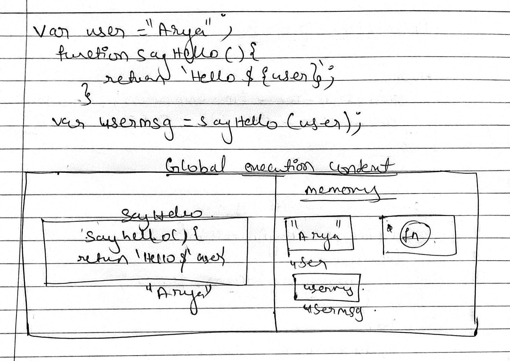
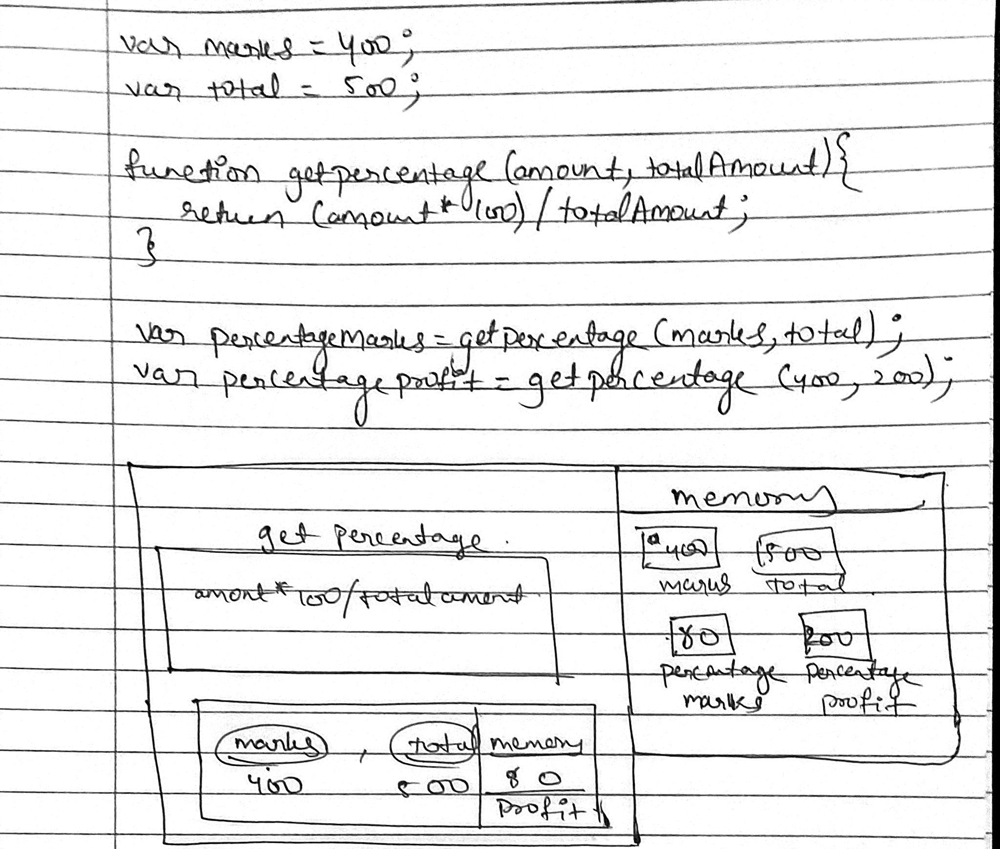

1. What does thread of execution means in JavaScript?
```js
Thread is the execution of running multiple tasks or programs at the same time. Each unit capable of executing code is called a thread.
```
2. Where the JavaScript code gets executed?
```js
JavaScript can execute not only in the browser, but also on the server, or actually on any device that has a special program called the JavaScript engine.
```

3. What does context means in Global Execution Context?
```js
This is the default execution context in which JS code start its execution when the file first loads in the browser.
```

4. When do you create a global execution context.
```js
Gec gets created by javascript engine whenever you are running anypiece of code.
```

5. Execution context consists of what all things?
```js
This object consists of variables, arguments, function declarations.
```

6. What are the different types of execution context?
```js
Global Execution Context — This is the default or base execution context.
Functional Execution Context — Every time a function is invoked, a brand new execution context is created for that function.
```

7. When global and function execution context gets created?
```js
global created by js engine whenever we are running any piece of code.
function craeted by whenever you are executing any function.
```

8. Function execution gets created during function execution or while declaring a function.
```js
While executing the global execution context code, if JS engine finds a function call, it creates a new functional execution context for that function. 
```


9. Create a execution context diagram of the following code on your notebook. Take a screenshot/photo and store it in the folder named `img`. Use `` to display it here.


```js
var user = "Arya";

function sayHello(){
  return `Hello ${user}`;
}

var userMsg = sayHello(user);
```

<!-- Put your image here -->




```js
var marks = 400;
var total = 500;

function getPercentage(amount, totalAmount){
  return (amount * 100) / totalAmount;
}

var percentageMarks = getPercentage(marks, total);
var percentageProfit = getPercentage(400, 200);
```



```js
var age = 21;

function customeMessage(userAge){
  if(userAge > 18){
    return `You are an adult`;
  }else {
    return `You are a kid`;
  }
}

var whoAmI = customeMessage(age);
var whoAmIAgain = customeMessage(12);
```

<!-- Put your image here -->

